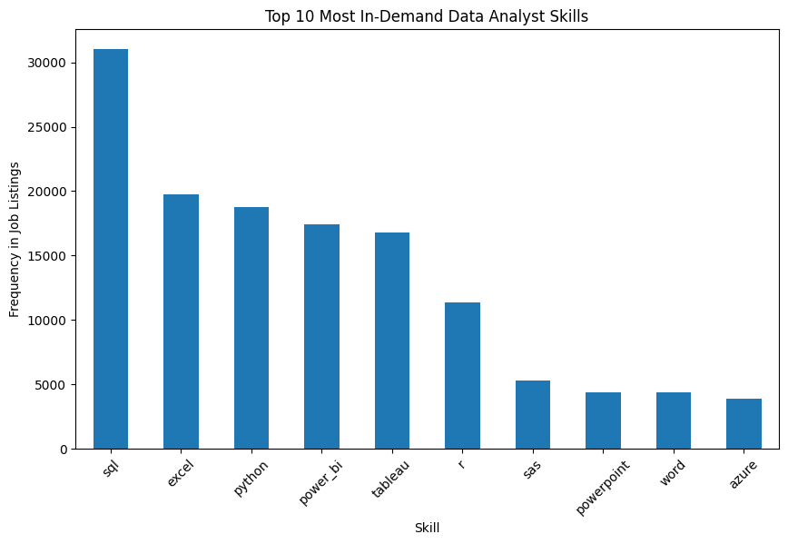

# Data Analyst Job Market Analysis

## Project Overview
This project analyses job listings for data analyst roles to identify the most in-demand technical skills in the job market.

Using Python and data analysis techniques, job description data was processed to extract commonly mentioned skills and visualise their frequency across job listings.

## Dataset
The dataset used for this project was obtained from Kaggle and contains job listing data including job titles, companies, locations, and tokenised job description keywords.

## Tools Used
- Python
- Pandas
- Matplotlib
- Google Colab

## Analysis Performed
The job description tokens were processed to extract technical skills mentioned in job postings. The most frequently occurring skills were then identified and visualised.

## Key Insights
- Python and SQL appear frequently in job listings, confirming they are core skills for data analysts.
- Excel remains a widely requested tool for data analysis roles.
- Business intelligence tools such as Power BI and Tableau also appear regularly in job descriptions.

## Visualisation

## Author
Parvez Hussain  
Mathematics Graduate 
